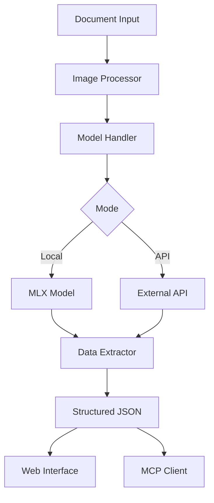

# 📄 Magic Document Scanner

Une application intelligente de traitement de documents avec OCR et extraction de données utilisant des modèles de vision-langage (VLM) en local ou via API.


## 📋 Table des matières

- [✨ Fonctionnalités](#-fonctionnalités)
- [🏗️ Architecture](#️-architecture)
- [🚀 Installation](#-installation)
- [🎯 Utilisation](#-utilisation)
- [⚙️ Configuration avancée](#️-configuration-avancée)
- [🔌 Intégration MCP](#-intégration-mcp)
- [📊 Performances](#-performances)
- [🛠️ Développement](#️-développement)
- [📄 Licence](#-licence)

## 🎯 Aperçu

**Magic Document Scanner** est une solution d'analyse documentaire intelligente qui combine la puissance des modèles de vision-langage modernes avec une interface utilisateur intuitive. L'application permet d'extraire automatiquement des informations structurées à partir de documents (PDF, images) en utilisant soit des modèles locaux optimisés (MLX sur Apple Silicon) soit des APIs externes.

### Points forts

- 🧠 **IA avancée** : Modèles de vision-langage pour comprendre le contexte
- ⚡ **Parallélisation optimisée** : Pool de threads configurable (1-20)
- 🎯 **Routage intelligent** : Filtrage des pages avant extraction (économie de coûts)
- 🌐 **Multi-plateforme** : MLX local (Apple Silicon) ou APIs externes
- 🔌 **Intégration MCP** : Compatible Claude Desktop et assistants IA
- 🛡️ **Sécurité renforcée** : Protection contre l'injection de prompts

## ✨ Fonctionnalités

### Analyse automatique de documents
- **Magic Scan** : Détection automatique des sections/champs dans les documents
- **Sections manuelles** : Possibilité de définir des champs personnalisés
- **Support multi-format** : PDF et images (PNG, JPEG, etc.)
- **Traitement par lot** : Analyse de plusieurs documents simultanément

### Extraction de valeurs
- **Sortie structurée** : Résultats JSON avec scores de confiance
- **Mode expert** : Instructions d'extraction personnalisées
- **Gestion des pages** : Suivi des informations à travers les pages PDF
- **Déduplication** : Gestion intelligente des informations en double

### Modes d'exécution
- **Mode MLX local** : Optimisé pour Mac Apple Silicon
- **Mode API externe** : Intégration Mistral AI, OpenAI, serveurs locaux
- **Détection automatique** : Basculement intelligent selon l'environnement

## 🏗️ Architecture



### Composants principaux

#### Core (`src/core/`)
- **`config.py`** : Gestion de la configuration et de l'état global
- **`model_handler.py`** : Chargement et utilisation des modèles
- **`api_client.py`** : Communication avec les APIs externes
- **`data_extractor.py`** : Logique d'analyse et d'extraction
- **`mcp_functions.py`** : Intégration MCP pour assistants IA

#### Interface (`src/ui/`)
- **`app.py`** : Interface web Gradio principale

#### Utilitaires (`src/utils/`)
- **`utils.py`** : Fonctions utilitaires générales
- **`image_processor.py`** : Traitement des images et PDF

## 🚀 Installation

### Prérequis
- Python 3.12+
- Pour Mac Apple Silicon : Support MLX natif
- Pour utilisation API : Clé API Mistral/OpenAI (optionnelle pour serveurs locaux)

### Installation standard

```bash
# Cloner le repository
git clone https://github.com/votre-username/MagicMistralOCR.git
cd MagicMistralOCR

# Créer un environnement virtuel
python -m venv venv
source venv/bin/activate  # Linux/Mac
# ou
venv\\Scripts\\activate  # Windows

# Installer les dépendances
pip install -r requirements.txt
```

### Installation Mac Apple Silicon (recommandée)

```bash
# Installation avec support MLX optimisé
pip install -r mac-requirements.txt
```

## ⚙️ Configuration

### Variables d'environnement

```bash
# API Configuration (optionnelle)
export api_server="https://api.mistral.ai/v1/chat/completions"
export api_model="mistral-small-latest"
export api_key="votre-clé-api"  # Optionnelle pour serveurs locaux

# Ou pour serveur local
export api_server="http://localhost:1234/v1/chat/completions"
export api_model="votre-modèle-local"
# Pas de clé API nécessaire pour localhost
```

### Configuration via l'interface

L'application détecte automatiquement votre environnement et configure le mode approprié :
- **Mac Apple Silicon** : Mode MLX local par défaut
- **Autres systèmes** : Mode API ou MLX fallback
- **Configuration dynamique** : Changement de mode via l'interface web

## 📖 Utilisation

### Démarrage de l'application

```bash
python main.py
```

L'interface sera disponible à l'adresse : `http://localhost:7860`

### Interface web

#### 1. **Onglet Configuration des sections**
- Téléchargez vos documents (PDF/images)
- Utilisez "Magic Scan" pour la détection automatique
- Ajoutez des sections manuelles si nécessaire
- Prévisualisez les sections détectées

#### 2. **Onglet Extraction des valeurs**
- Sélectionnez les sections à extraire
- Activez le mode expert pour des instructions personnalisées
- Lancez l'extraction et téléchargez les résultats JSON

#### 3. **Onglet API/MCP**
- Configurez les paramètres API
- Consultez les informations d'intégration MCP
- Vérifiez le statut du système

### Utilisation programmatique

```python
from src.core.mcp_functions import analyze_document, extract_values

# Analyse automatique
sections = analyze_document("path/to/document.pdf")

# Extraction de valeurs spécifiques
values = extract_values("path/to/document.pdf", sections_to_extract)
```

## 🔌 Intégration MCP

### Configuration Claude Desktop

Ajoutez à votre `claude_desktop_config.json` :

```json
{
  "mcpServers": {
    "magic-mistral-ocr": {
      "command": "python",
      "args": ["/path/to/MagicMistralOCR/mcp_server.py"],
      "env": {
        "api_key": "votre-clé-api"
      }
    }
  }
}
```

### Fonctions MCP disponibles

- **`analyze_document`** : Analyse complète d'un document
- **`extract_values`** : Extraction de valeurs spécifiques

### Exemple d'utilisation dans Claude

```
Analyse ce document : /path/to/invoice.pdf
```

Claude utilisera automatiquement MagicMistralOCR pour analyser le document et extraire les informations pertinentes.

## 📁 Structure du projet

```
MagicMistralOCR/
├── main.py                # Point d'entrée principal
├── mcp_server.py          # Serveur MCP
├── requirements.txt       # Dépendances standard
├── mac-requirements.txt   # Dépendances Mac MLX
├── README.md             # Documentation
├── LICENSE               # Licence AGPL-3.0
└── src/                  # Code source organisé
    ├── __init__.py
    ├── core/             # Modules principaux
    │   ├── __init__.py
    │   ├── config.py         # Configuration globale
    │   ├── model_handler.py  # Gestion des modèles
    │   ├── api_client.py     # Client API externe
    │   ├── data_extractor.py # Logique d'extraction
    │   └── mcp_functions.py  # Fonctions MCP
    ├── ui/               # Interface utilisateur
    │   ├── __init__.py
    │   └── app.py           # Interface Gradio
    └── utils/            # Utilitaires
        ├── __init__.py
        ├── utils.py          # Fonctions utilitaires
        └── image_processor.py # Traitement d'images
```

## 🤝 Contribution

Les contributions sont les bienvenues ! 

### Processus de contribution

1. Fork the repository
2. Créez une branche feature (`git checkout -b feature/nouvelle-fonctionnalite`)
3. Committez vos changements (`git commit -am 'Ajout nouvelle fonctionnalité'`)
4. Push vers la branche (`git push origin feature/nouvelle-fonctionnalite`)
5. Créez une Pull Request

### Guidelines

- Respectez le style de code existant
- Ajoutez des tests pour les nouvelles fonctionnalités
- Mettez à jour la documentation
- Suivez les principes de sécurité (pas de clés en dur)

## 🛡️ Sécurité

- ✅ Support des APIs locales sans authentification
- ✅ Clés API optionnelles pour serveurs localhost
- ✅ Nettoyage automatique des fichiers temporaires
- ✅ Validation des entrées utilisateur
- ✅ Gestion sécurisée des erreurs

## 📊 Performances

### Optimisations

- **MLX natif** : Performances optimales sur Apple Silicon
- **Gestion mémoire** : Nettoyage automatique des ressources
- **Traitement par lot** : Analyse efficace de multiples documents
- **Cache intelligent** : Réutilisation des ressources quand possible

### Benchmarks

- **Mac M1/M2** : ~2-5 secondes par page (mode MLX)
- **API externe** : ~5-15 secondes par page (selon le service)
- **Support PDF** : Jusqu'à 100+ pages par document

## 📄 Licence

Ce projet est sous licence **GNU Affero General Public License v3.0 (AGPL-3.0)**.

```
MagicMistralOCR - Analyse intelligente de documents avec IA
Copyright (C) 2024

This program is free software: you can redistribute it and/or modify
it under the terms of the GNU Affero General Public License as published
by the Free Software Foundation, either version 3 of the License, or
(at your option) any later version.

This program is distributed in the hope that it will be useful,
but WITHOUT ANY WARRANTY; without even the implied warranty of
MERCHANTABILITY or FITNESS FOR A PARTICULAR PURPOSE. See the
GNU Affero General Public License for more details.
```

## 🙏 Remerciements

- **Mistral AI** pour les modèles de langage avancés
- **MLX** pour l'optimisation Apple Silicon
- **Gradio** pour l'interface utilisateur intuitive
- **MCP Protocol** pour l'intégration avec les assistants IA

---

**📧 Support** : Ouvrez une [issue](https://github.com/votre-username/MagicMistralOCR/issues) pour signaler des bugs ou demander des fonctionnalités.

**⭐ Star ce projet** si vous le trouvez utile !